# 数据降维与可视化方法

---

## _Contents_ 

+ 我们要讨论的数据与降维
+ PCA 主成分分析算法
+ t-SNE T分布邻域嵌入算法
+ UMAP 均匀流形近似和投影算法


---

## 开始之前 —— 我们要讨论的数据和维度

### 数学、物理学、数据科学、机器学习······每个领域都有微小的差异

#### 张量、向量、矢量、样本点、数据点、集合······

### 物理学所说宇宙是 $11$ 维的，与数据科学所说数据是 $11$ 维的意义几乎不一致。

---

## 开始之前 —— 数据点

+ **数据点**: $n$ 个数字组成的列向量。

$$
    X_i = \begin{bmatrix} 1 \\ 3.1 \\ ...\end{bmatrix}_{n}
$$

---

## 开始之前 —— 数据与维度

+ **数据**: $m$ 个列向量转置组成的数据点矩阵 $or$ 张量。
+ **维度(维数)**: 每个数据点的元素个数 $n$ $or$  数据集的列数。

$$
    data = \begin{bmatrix}
X^{T}_0 \\ X^{T}_1 \\ ... \end{bmatrix}_{m \times n} 
$$

---

# 从 _What is, Why is, and How to_ 继续

---

## _What ?_

### _wiki_: 

> **Dimensionality Reduction (DR)** is the transformation of data from a high-dimensional space into a low-dimensional space so that the low-dimensional representation retains some meaningful properties of the original data, ideally close to its intrinsic dimension. 

> 在机器学习和统计学领域，降维是指在某些限定条件下，降低随机变量个数，得到一组主变量的过程。是一种去除冗余特征、噪声和不相关数据的预处理步骤，能提高学习特征的准确性并缩短训练时间。

---

## _What ?_

## 不应用过多复杂概念解释单一概念，用尽量少的复杂概念解释

## _**数据降维：一种减少维数并尽可能保留原始数据统计特性的数据处理方法**_

---

## _Why DR?——维数灾难_


$100$ 个平均分布的点能把一个单位区间以每个点距离不超过 $0.01$ 采样

而当维度增加到 $10$ 后，如果以相邻点距离不超过 $0.01$ 小方格采样一单位超正方体，则需要 $10^{20}$ 个采样点

所以，这个 $10$ 维的超正方体也可以说是比单位区间大 $10^{18}$ 倍。

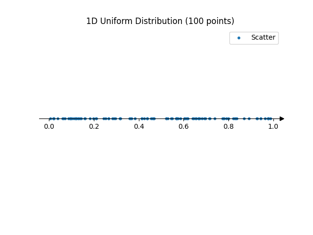

---

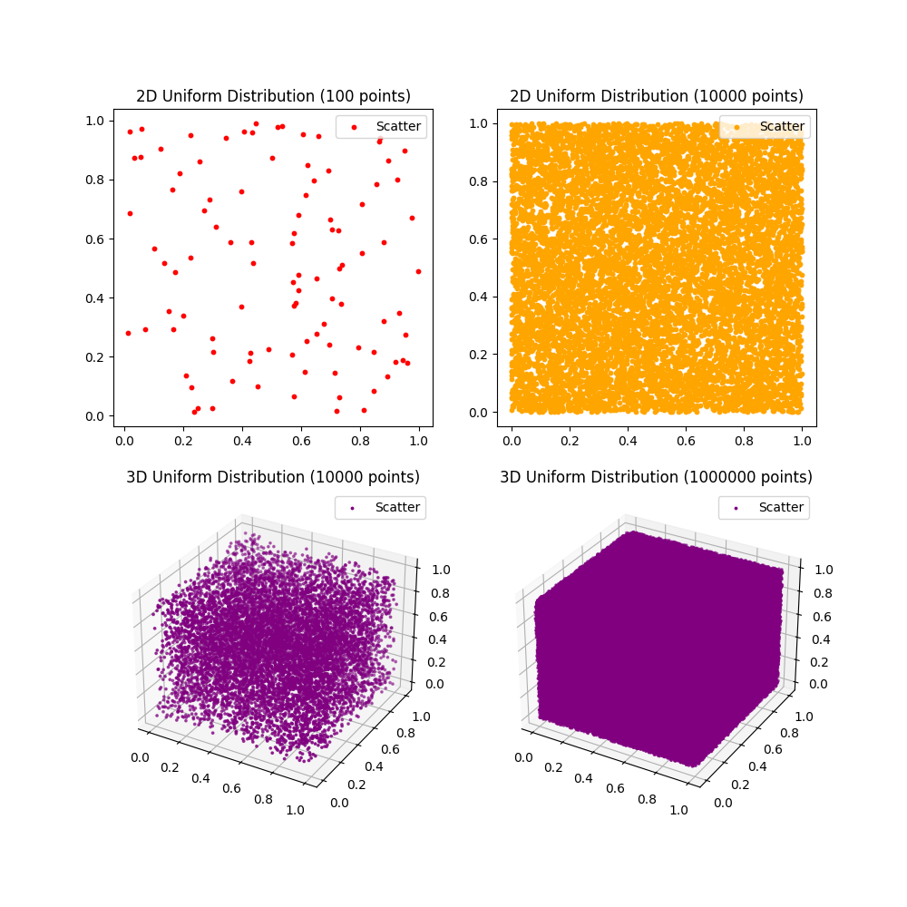

## 维数灾难

+ 样本点个数每增加 $1$ 维，样本点个数需要以指数级增长才足以将空间填满。

+ 样本点个数有限，升维将导致样本变稀疏，难以获得统计学上正确且可靠的结果。

---

## _DR Good or Bad ?_ 

+ 优点
    + 通过减小特征的维度，存储数据集所需的空间也会减少。
    + 减少特征的维度所需的计算训练时间更少。
    + 数据集特征维度的减小有助于快速可视化数据。
    + 删除冗余特征。
+ 缺点
    + 降维算法不合适导致主成分丢失。

---

## _Step Further——Another Perspective_

##  可视化高维数据分布

---

##  可视化高维数据分布

+ 即使是一个典型任务，收集到的数据也难以观察规律。当然，除非你注意力惊人。
+ 难以从数据本身得知数据质量以及数据对任务的影响程度。

**可视化在一定程度上能帮助我们了解数据的分布情况，以便后续工作开展。**

---

##  可视化高维数据分布

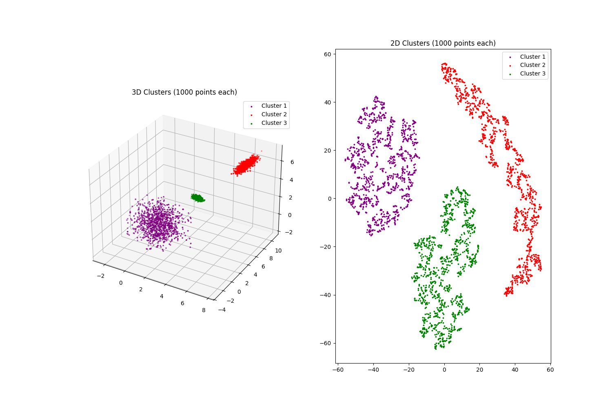

红色簇在3维可视化时仿佛不错，但观察二维情况却并没有真正聚在一起。

_实际在生成数据时，红色簇的不同维度之间偏差很大，而其余簇的不同维度偏差较小(几乎同分布)_

---

# Principal Component Analysis (PCA)

## 数据降维之主成分分析法

---

## 何为降维？

降维就是将**高维数据**转换成**低维数据**，同时尽量保留原始数据的主要信息。

比如，你有一张高清彩色图片，像素为 $1000\times 1000\times 3$ （高 × 宽 × 颜色通道），如果每个像素点都看成一个维度，这张图片可以有 $3,000,000$ 维！要处理这么高的维度非常复杂，所以咱们可能需要降维，例如把它转换成灰度图（$1000\times 1000$），或者压缩成一个缩略图（$100\times 100$）。

---

# 主成分分析法

## 核心思想

1. 找出数据分布变化最大的方向，称为**主成分**。
2. 用这些主成分来表示数据，而忽略其他变化较小的方向。

## 最早提出

> Pearson, K. (1901). "On Lines and Planes of Closest Fit to Systems of Points in Space". Philosophical Magazine. 2 (11): 559–572. doi:10.1080/14786440109462720. S2CID 125037489

---

## 举个 🌰：把水果装进箱子

假设你有许多形状各异的水果（比如苹果、香蕉、橘子），你想把它们装进一个长方体箱子里，但你希望用尽量少的箱子就能装完水果。

- 水果形状是原始数据（高维）。
- 箱子是降维后的空间（低维）。

水果的形状可能由以下三个特征决定：

- 长度（x 轴），比如香蕉较长。
- 宽度（y 轴），比如苹果较宽。
- 高度（z 轴），比如橘子较矮。

---

将水果形状转换到箱子形状的过程中，我们已经完成了一次数据降维。

### 那么.. 是否还可以继续降维？

答案是肯定的，如果我们观察到的水果中，大部分高度差异都不明显，那么我们就可以忽略“高度”这个特征，仅使用长度和宽度来描述水果的形状。

## 这个就是主成分分析的过程。

---

## 第二颗 🌰：血压和胆固醇水平对照数据集

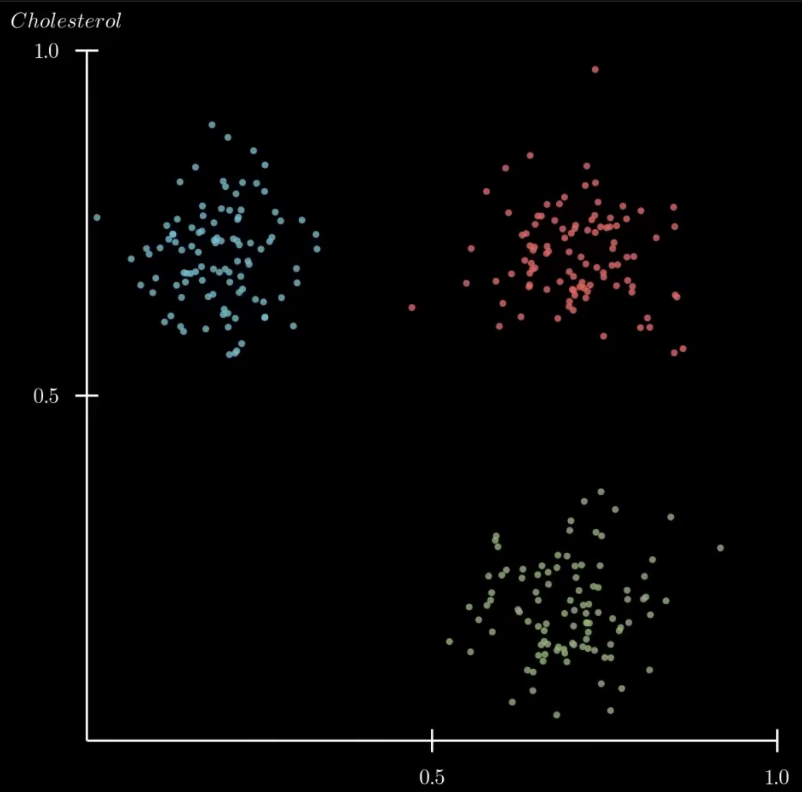

---

## 数学上，我们如何进行主成分分析？

主成分分析需要从多维度的数据中分析得到主要成分，考虑使用协方差。

在概率论与统计学中，协方差(Covariance)用于衡量随机变量间的相关程度。

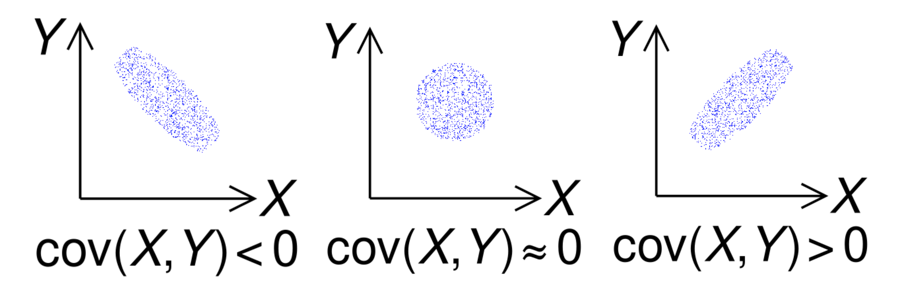

协方差矩阵描述了数据不同维度之间的**相关性**以及每个维度的**方差大小**。

- 对角线元素是每个维度的方差，表示该维度数据的分散程度。
- 非对角线元素是不同维度之间的协方差，表示它们的线性相关程度。

---

通过协方差矩阵，我们可以了解数据在多维空间中的形状和相互关系。因此，主成分分析主要通过计算协方差矩阵来提取数据的主要特征，从而实现数据的降维。

### 特征值和特征向量

对于一个给定的矩阵 $A$，它的特征向量(eigenvector) $v$ 经过这个线性变换之后，得到的新向量仍然与原来的 $v$ 保持在同一条直线上，但其长度或方向也许会改变。即 $Av=\lambda v$，其中 $\lambda$ 为标量，即特征向量的长度在该线性变换下缩放的比例，称 $\lambda$ 为其特征值(eigenvalue)。

**所有的特征向量组成了这向量空间的一组基底**。一个特征空间(eigenspace)是具有相同特征值的特征向量与一个同维数的零向量的集合。

---

## 特征向量和特征值的几何意义

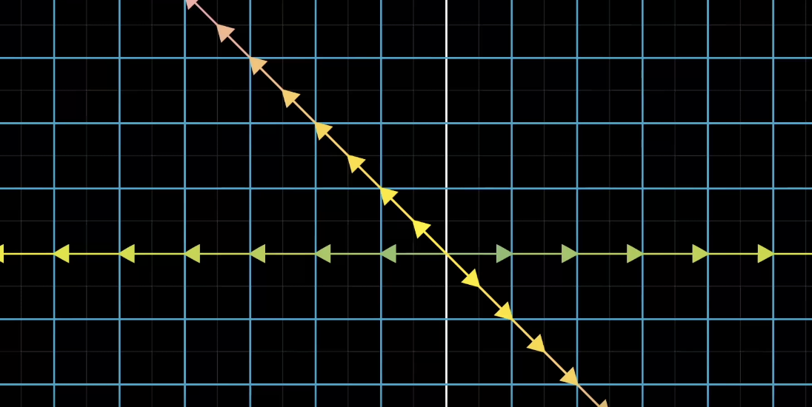

---

## 协方差矩阵的特征值和特征向量告诉我们数据的主要特征

### 特征向量：主要方向

特征向量定义了数据的主要变化方向，是数据的分布在多维空间中最重要的轴。每个特征向量都与一个特征值对应，特征值越大，特征向量对应的方向越重要。

### 特征值：数据的方差大小

协方差矩阵的特征值表示数据在对应方向（由特征向量定义）上的方差大小。方差越大，说明数据在该方向上的变化越重要。

---

## 主成分分析使用协方差的特征值和特征向量进行数据降维

- 选择较大的特征值及其对应的特征向量。
- 把数据投影到这些方向上，从而最大化保留数据的总方差（即信息量）。

### 这种方法之所以有效，是因为

- 大的特征值对应的方向包含了数据的主要变化趋势。
- 小的特征值方向上的变化可以被视为噪声或次要信息，可以忽略。

想象一团椭圆形的点云数据，特征向量告诉我们椭圆的长轴和短轴方向，特征值则告诉我们这些轴的长度。长轴方向（对应较大的特征值）往往是数据分布的主要特征。

---

### 核心目标

将高维数据投影到一个低维子空间，使得投影后的数据尽可能保留原始数据的方差信息。

### 四个主要步骤

1. **中心化数据**。基于协方差矩阵来计算，我们需要先中心化数据。

2. **计算协方差矩阵**。协方差矩阵描述了数据的两个特征之间的关系。

3. **计算特征值和特征向量**。协方差矩阵的特征值和特征向量提示主成分的方向和重要性。

4. **投影到主成分**。选择最重要的几个特征向量，将数据投影到这些特征向量上，完成降维。

---

## 1. 中心化数据

通常，为了确保第一主成分描述的是最大方差的方向，我们会使用平均减法进行主成分分析。如果不执行平均减法，第一主成分有可能或多或少的对应于数据的平均值。中心化数据做的就是这一步，将数据的均值移动到原点。

$x_{\text{centered}} = x - \bar{x}$

$\bar{x} = \frac{1}{n}\sum_{i=1}^{n}x_i$

$x$ 是原始数据，$\bar{x}$ 是数据的均值，$x_{\text{centered}}$ 是中心化后的数据。

**只有中心化数据后，特征向量才有最大意义（经过原点）。**

---

**只有中心化数据后，特征向量才有最大意义（经过原点）。**

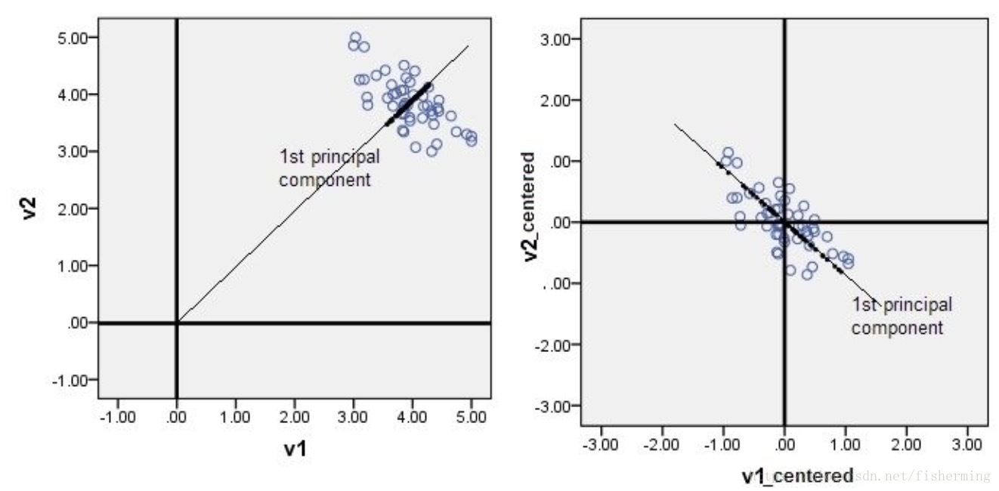

---

## 2. 计算协方差矩阵

协方差矩阵是一个对称矩阵，对角线元素是每个维度的方差，非对角线元素是不同维度之间的协方差。

$\Sigma = \frac{1}{n}X^TX$

$\Sigma$ 是协方差矩阵，$X$ 是中心化后的数据，$n$ 是数据的数量。

---

## 3. 计算特征值和特征向量

协方差矩阵的特征值和特征向量描述了数据的主要特征。

$\Sigma v = \lambda v$

$\Sigma$ 是协方差矩阵，$v$ 是特征向量，$\lambda$ 是特征值。

---

## 4. 投影到主成分

选择最重要的几个特征向量，将数据投影到这些特征向量上，完成降维。

$X_{\text{reduced}} = Xv_{\text{important}}$

$X_{\text{reduced}}$ 是降维后的数据，$X$ 是中心化后的数据，$v_{\text{important}}$ 是最重要的特征向量。

---

## PCA 的优点

- 依赖基本的线性代数，时间复杂度低

  $O(nd^2+d^3)$， $n$ 是数据的数量，$d$ 是数据的维度。

- 特征权重的可提取和可解释性

  特征值表示了该特征向量的重要性，可以用于特征选择。

---

## PCA 的缺点

- 对数据的分布有假设，无法处理非线性数据

  PCA 假设数据是线性分布的，如果数据是非线性分布的，PCA 的效果可能不好。

- 对数据量纲敏感

  如果不进行标准化处理，数据量纲不同会影响 PCA 的结果。

- 可解释性较弱

  PCA 降维后的特征向量往往难以解释，不如原始数据的特征容易理解。

---

## 算法实现 —— 数据标准化

```py
import numpy as np

# 每行是一个样本，每列是一个特征
data = np.array([[2.5, 2.4],... [1.1, 0.9]])

# 1. 数据标准化：减去均值
mean = np.mean(data, axis=0)
data_centered = data - mean

```

---

## 算法实现 —— 计算协方差矩阵的特征值和特征向量

```py

# 2. 计算协方差矩阵
cov_matrix = np.cov(data_centered, rowvar=False)

# 3. 计算协方差矩阵的特征值和特征向量
eigenvalues, eigenvectors = np.linalg.eig(cov_matrix)

```

---

## 算法实现 ——  选择主成分并进行数据投影

```py

# 4. 按特征值从大到小排序
sorted_indices = np.argsort(eigenvalues)[::-1]
eigenvalues = eigenvalues[sorted_indices]
eigenvectors = eigenvectors[:, sorted_indices]

# 5. 选择主成分（例如前两个）
n_components = 2
principal_components = eigenvectors[:, :n_components]

# 6. 投影数据到主成分空间
transformed_data = np.dot(data_centered, principal_components)
```

---

# t-SNE _T-分布邻域嵌入算法_

---

## 1 t-SNE的定义

- t-SNE 是一种非线性降维技术，主要用于高维数据的可视化。它能有效地将高维数据映射到二维或三维空间中，同时保持数据的局部结构。
- t-SNE 将高维数据中的相似性度量转化为低维空间中的相似性度量，通过最小化两者之间的 Kullback-Leibler 散度来实现降维。t-SNE 的核心在于将原始高维空间的距离关系映射到低维空间中，尽量保持数据的邻近关系。

---

&emsp;
&emsp;
&emsp;
&emsp;
&emsp;
&emsp;

---

# 数学原理

## 2.1 SNE的核心步骤

---

### 2.1.1 将欧氏距离转化为条件概率来表征点间相似度

SNE算法的第一步是测量一个点相对于其他点的距离。我们不是直接处理这些距离，而是将它们映射到一个概率分布。

&emsp;
&emsp;
&emsp;
&emsp;
&emsp;

---

在分布中，相对于当前点距离最小的点有很高的概率，而远离当前点的点有很低的概率。


---

## 再看2D图

由于蓝色的点团比绿色的点团更分散，如果我们不解决比例上的差异，绿色点的概率将大于蓝色点的概率。为了解释这一事实，我们需要进行归一化。


因此，尽管两点之间的绝对距离不同，但它们被认为是相似的。

---

+ 数学上，正态分布的方程如下：
$$
P(x)=\dfrac{1}{\sigma\sqrt{2\pi}}\exp{\big{(}\dfrac{-(x-\mu)^2}{2\sigma^2}\big{)}}
$$

+ 给定高维空间的数据点：

$$ x_1,x_2,...,x_n,p_{i|j} $$

则可得出以$x_i$自己为中心，以高斯分布选择$x_j$作为近邻点的条件概率公式：

$$ p_{j|i}=\dfrac{exp(-\|x_i-x_j\|^2/2\sigma_i^2)}{\Sigma_{k\not=i}exp(-\|x_i-x_k\|^2/2\sigma_i^2)} $$

---

同理，有低维空间的映射点：$y_1,y_2,...,y_n$

分别对应：$x_1,x_2,...,x_n$

$q_(j|i)$ 是 $y_i$ 以自己为中心，以高斯分布选择 $y_j$ 作为近邻点的条件概率：

$$ q_{j|i}=\frac{exp(-\|y_i-y_j\|^2)}{\Sigma_{k\not=i}exp(-\|y_i-y_k\|^2)} $$


---

### 2.1.2 使用梯度下降算法来使低维分布学习/拟合高维分布

SNE的目标是让低维分布去拟合高维分布，则目标是令两个分布一致。两个分布的一致程度可以使用相对熵（也叫做KL散度）来衡量，可以以此定义代价函数:

$$ C=\sum_iKL(P_i\|Q_i)=\sum_i\sum_jp_{j|i}log\frac{p_{j|i}}{q_{j|i}} $$

对C进行梯度下降即可以学习到合适的 $y_i$

$$\dfrac{\partial C}{\partial y_i}=2\Sigma_j(p_{j|i}-q_{j|i}+p_{i|j}-q_{i|j})(y_i-y_j)$$

---

下面是 KL 散度变化对分布的影响


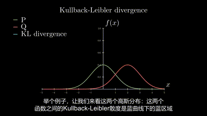

---

## 2.2 t-SNE的优化

---

### 2.2.1 拥挤问题

- 在二维映射空间中，能容纳（高维空间中的）中等距离间隔点的空间，不会比能容纳（高维空间中的）相近点的空间大太多
- 换言之，哪怕高维空间中离得较远的点，在低维空间中留不出这么多空间来映射。于是到最后高维空间中的点，尤其是远距离和中等距离的点，在低维空间中统统被塞在了一起，这就叫做“拥挤问题”
- 拥挤问题带来的一个直接后果，就是高维空间中分离的簇，在低维中被分的不明显（但是可以分成一个个区块）。比如用SNE去可视化MNIST数据集的结果如下：

---

### 2.2.1 拥挤问题

右图是一个拥挤问题的示例。

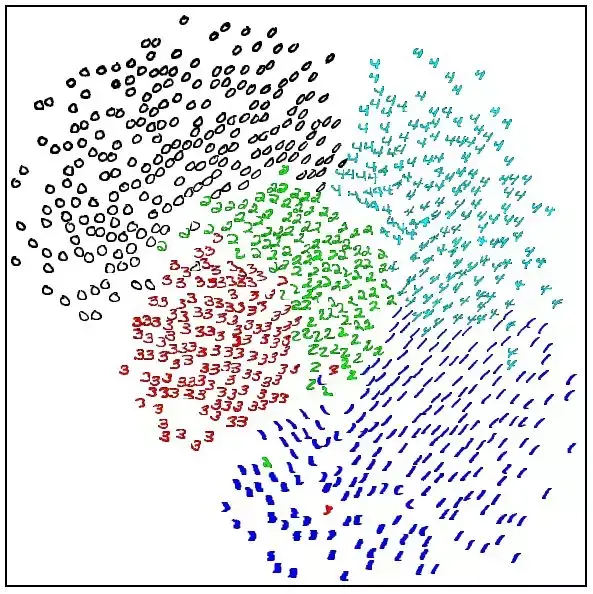

---

### 2.2.2 t分布的引用

t-分布的概率密度函数形式为，其中 $\nu$ 为自由度。

$$ f(t)=\dfrac{\Gamma(\frac{\nu+1}{2})}{\sqrt{\nu\pi}\Gamma(\frac{\nu}{2})}(1+\frac{t^2}{\nu})^{-\frac{\nu+1}{2}} $$

---

### 2.2.2 t分布的引用

我们在低维空间的分布中，把原先用的高斯分布（自由度为 $\infty$ ）改成自由度为1的分布（把尾巴抬高）。下图可以很好地说明为什么“把尾巴抬高”可以很好地缓解拥挤问题。


---

## 采用t-SNE对MNIST数据集的降维可视化效果:

&emsp;
&emsp;
&emsp;
&emsp;
&emsp;
&emsp;

---

### 2.2.3 困惑度
- 使用t-SNE时，除了指定想要降维的维度，另一个重要的参数是困惑度（Perplexity）
- 困惑度大致表示如何在局部或者全局位面上平衡关注点，再说的具体一点就是关于对每个点周围邻居数量猜测。困惑度对最终成图有着复杂的影响。
- 使用算法来确定 $σ_i$ 则要求用户预设困惑度,然后算法找到合适的 $σ_i$ 值让条件分布 $P_i$ 的困惑度等于用户预定义的困惑度即可。

$$ Perp(P_i)=2^{H(P_i)}=2^{-\Sigma_jp_{j|i}log_2p_{j|i}} $$

---

### 2.2.3 困惑度

&emsp;
&emsp;
&emsp;
&emsp;
&emsp;
&emsp;

---

# 3 t-SNE 代码示例

---

## 3.1 导入必要模块

```py
import matplotlib.pyplot as plt
from sklearn.datasets import load_digits
from sklearn.manifold import TSNE
import seaborn as sns
```

---

## 3.2 加载数字数据集

```py
digits = load_digits()
X, y = digits.data, digits.target
```

---

## 3.3 进行降维并可视化

```python
# t-SNE 降维
tsne = TSNE(n_components=2, random_state=42, perplexity=30, n_iter=1000)
X_embedded = tsne.fit_transform(X)

# 可视化
plt.figure(figsize=(10, 8))
sns.scatterplot(
    x=X_embedded[:, 0],
    y=X_embedded[:, 1],
    hue=y,
    palette=sns.color_palette("tab10", len(set(y))),
    legend="full")
plt.title("t-SNE Visualization of Digits Dataset")
plt.xlabel("Dimension 1")
plt.ylabel("Dimension 2")
plt.show()
```
---

## _UMAP: Uniform Manifold Approximation and Projection for Dimension Reduction_ 均匀流形近似和投影

---

## UMAP

一种基于图论和流形学习的方法，通过构建加权`k neighbor`图，，用于将高维数据映射到低维空间。

+ **流形学习**：UMAP 建立在流形学习的基础上，该理论认为即使在高维空间中，许多真实世界的数据点也可以近似地分布在一个低维流形上。

+ **代数拓扑**：UMAP 利用了代数拓扑的概念，特别是对邻域图的同胚嵌入来估计数据流形上的全局和局部连通性。不仅关注数据点之间的局部相似性，还考虑了数据在整个数据集中的相对位置和全局关系。

+ **黎曼几何**：UMAP 假设数据均匀分布在某种局部恒定度量的空间中，并且这个空间可以通过数学操作进行近似。

---

## UMAP 基本过程

> As with other k-neighbour graph based algorithms, UMAP can be de-
scribed in two phases. In the first phase a particular weighted k-neighbour
graph is constructed. In the second phase a low dimensional layout of this
graph is computed. 

与其他 $k$-邻近图算法一致，UMAP主要分为：

1. 构建特定的加权 $k$-邻近图。
2. 计算该图的低维分布。

---

## UMAP —— A Computational View

### 图形构建——高维计算

> For the purposes of our UMAP implemenation we prefer to use the nearest neighbor descent algorithm of $k-nearest \ neighbor \ graph \ construction$

UMAP 使用一种类似 $k$-最邻近算法进行图形构建。$k$ 作为超参数，可以指定。

---

## UMAP —— A Computational View

### 图形构建——高维计算

此处，我们将数据中的每一个行即一个数据点的所有维度进行 $k-nearest$ 计算， $n$ 个维度则产生 $n$ 张图。

例如 $\big{[}1, 4, 5, 1, 0, 2\big{]}$，每次将选择其中一个数作为邻近点，其他数作为图中的节点，图中产生多少条边则由 $k$ 决定。

---

$e.g.$ 数据点$\big{[}1, 4, 5, 1, 0, 2\big{]}$。实际上产生的图可能比这更多，一般由维数决定，一次将产生 $6$ 张图。 

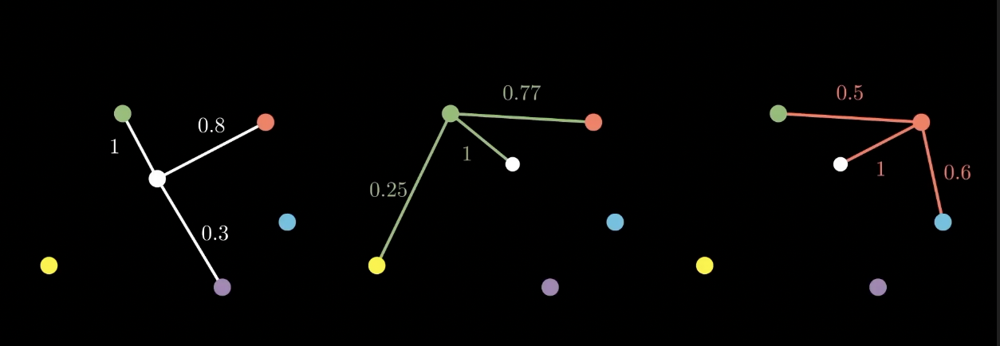

---

## UMAP —— A Computational View

### 图形构建——高维计算

1. $x_{i_j}$ 表示一个临近点，$\rho_i$ 为某点 $x_i$ 与其邻近点之间的距离。
$$
\rho_i = \min{\{d(x_i, x_{i_j})\bigg{|} 1 \le j \le k, d(x_i, x_j) \gt 0\}}  
$$

2. 导出 $\sigma_i$，通过下式计算解出 $\sigma_i$。

$$
\sum^{k}_{j=1}\exp{\left(\dfrac{-\max{(0,d(x_i, x_{i_j})-\rho_i)}}{\sigma_i}\right)} = \log_{2}(k)
$$

---

## UMAP —— A Computational View

### 图形构建——高维计算

和 SNE 一样，UMAP 的计算包括高维计算和低维计算，最终的目的是通过一定的算法将高维图结构与低维图结构进行匹配。

1. 获取带权图中点与邻近点间的权值

$$
w((x_i,x_{i_j}))= \exp{\left(\dfrac{-\max{(0, d(x_i,x_{i_j} ) - \rho_i)}}{\sigma_i} \right)}
$$

由于还不是最后使用的权值，这里我们把 $w((x_i, x_{i_j}))$ 记为 $v_{i} \to v_{i_j}$ 以免与后文混淆。

---

2. 将某个数据点产生的图进行归一化计算。将 $v_{i} \to v_{i_j} 记为 A$， $v_{i_j} \to v_{i} 记为 B$，最终的权值应更新为

$$
w_{ij} = A + B - A \times B
$$

&emsp;
&emsp;
&emsp;
&emsp;
&emsp;

---

## UMAP —— A Computational View

### 图形构建——低维计算

> UMAP uses a force directed graph layout algorithm in low dimensional space.

+ UMAP 使用力导向图，使用一种模拟斥力和引力的方式，沿边缘施加一组吸引力并在顶点之间施加一组排斥力，通过在每个边或顶点迭代地施加吸引力和排斥力来进行。
+ 这相当于一个非凸优化问题。通过 **缓慢降低(需要进行迭代)** 吸引力和排斥力，可以保证收敛到局部最小值。

---

## UMAP —— A Computational View

### 图形构建——低维计算

1. 两个顶点 $i$ 和 $j$ 在坐标 $y_i$ 和 $y_j$ 处的吸引力，其中 $a,b$ 为超参数。

$$
\dfrac{-2ab \|\symbfit{y_i} - \symbfit{y_j} \|^{2(b-1)}_{2}}{\| 1 + \symbfit{y_i} - \symbfit{y_j} \|^{2}_{2}}w((x_i, x_j))(\symbfit{y_i} - \symbfit{y_j})
$$

2. 排斥力是通过采样计算，每当对一条边施加吸引力时，该边的一个顶点就会被其他顶点的采样排斥。

$$
\dfrac{2b}{\big{(}\epsilon + \|\symbfit{y_i-y_j} \|^{2}_{2}\big{)}\big{(} 1 + a\| \symbfit{y_i - y_j}^{2b}_{2} \|  \big{)}}(1 - w((x_i,x_j)))(\symbfit{y_i - y_j})
$$

---

## UMAP —— A Computational View

### 图形构建——高维匹配低维

使用高维加权图 $G$ 和由点 $\{y_i\}_{i=1..N}$ 构建的等效加权图 $H$ 之间使用交叉熵的进行随机梯度下降。

由于加权图 $G$ 捕获了源数据的拓扑结构，因此由点 $\{y_i\}_{i=1..N}$ 构建的等效加权图 $H$ 与拓扑结构在优化允许的范围内尽可能接近，从而为数据的整体拓扑结构提供良好的低维表示。

---

## 直观展示

经典的数字分类数据集，共 $1797$ 个数字图片，每个图片为$8 \times 8$的灰度图，每个像素值为 $0 \to 15$的整数。每张图片可以展开成64维的列向量。

> Number of Instances: 1797
Number of Attributes: 64
Attribute Information: 8x8 image of integer pixels in the range 0..16.
Missing Attribute Values: None
Creator: E. Alpaydin (alpaydin '@' boun.edu.tr)
Date: July; 1998

---

## 直观展示

我们可以将数据的 $1 \to 10$列绘制一张 $pairplot$。但是对于64维的数据，这显示不够，但我们也不可能画 $64 \times 64$ 的 $pairplot$。

&emsp;
&emsp;
&emsp;
&emsp;
&emsp;
&emsp;
&emsp;
&emsp;

---

## UMAP 默认参数结果

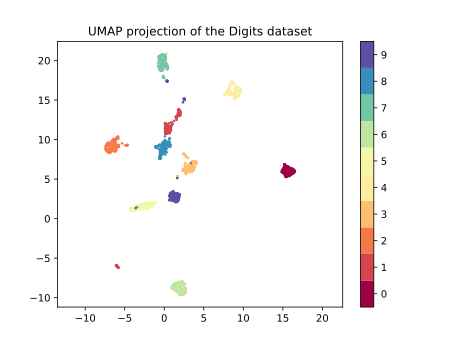
